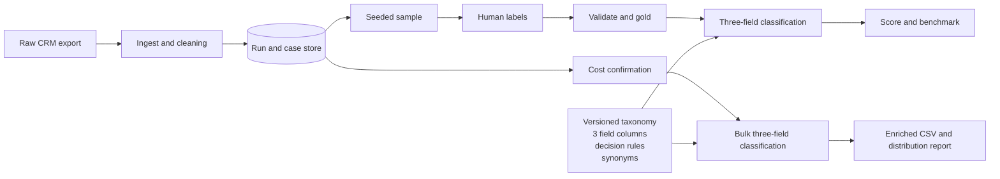

# Support Ticket Intelligence — measured LLM classification case study

Built an AI-assisted support-ticket analysis pipeline that enriched **701 CRM cases** across
three dimensions:

1. **Product area**
2. **Feature workflow**
3. **Issue type**

A **100-ticket human benchmark** measured **64.2% agreement across individual field decisions**,
including **75.3%** on product area. The aggregate label mix achieved **81% distribution overlap**
with the expert-labeled sample.

The project also validated a one-call-per-ticket JSON format that reduced model calls by **67%**
while preserving benchmark performance within **0.4 percentage points**. The full-population run
cost approximately **$2** and completed with zero API failures.

> This is a public, sanitized case study. The private application, customer messages, proprietary taxonomy, and employer-specific code are not published.

## Repository highlights

- [`examples/sample_taxonomy.xlsx`](examples/sample_taxonomy.xlsx) — synthetic three-sheet
  taxonomy with separate product-area, feature-workflow, and issue-type columns
- [`examples/synthetic_gold.csv`](examples/synthetic_gold.csv) — three human-label columns
- [`examples/synthetic_predictions.csv`](examples/synthetic_predictions.csv) — three matching
  LLM prediction columns
- [`scripts/score_example.py`](scripts/score_example.py) — runnable three-field evaluator
- [`docs/technical-overview.md`](docs/technical-overview.md) — sanitized technical design
- [`docs/methodology.md`](docs/methodology.md) — evaluation and interpretation

## Three-field schema

| Human benchmark field | Model prediction field |
|---|---|
| `human_product_area_l1` | `llm_product_area` |
| `human_feature_workflow_l1` | `llm_feature_workflow` |
| `issue_type` | `llm_issue_type` |

## Verified private-project results

| Metric | Result |
|---|---:|
| Product-area agreement | **75.3%** |
| Feature-workflow agreement | **64.5%** |
| Issue-type agreement | **52.7%** |
| Aggregate field agreement | **64.2%** |
| Strict all-three exact match | **33.3%** |
| Aggregate distribution overlap | **81.0%** |
| Full-population model cost | **~$2** |
| Model-call reduction | **67%** |

These figures answer different questions. Aggregate field agreement checks individual label
decisions. Strict exact match requires all three fields on the same ticket to be correct.
Distribution overlap checks whether the overall category mix was similar.

## Run the synthetic evaluator

```bash
python scripts/score_example.py
```

The script reads the three-column gold and prediction files and reports metrics for all three
classification fields.

## Conceptual architecture



## What the project demonstrated

- A broad CRM reason structure hid operationally meaningful workflow demand
- A governed taxonomy and benchmark made model behavior measurable
- Aggregate support-volume analysis was useful before ticket-level automation was reliable
- One-call combined classification reduced cost without a measurable benchmark loss
- The analysis informed a simpler operational recommendation: improve native CRM reason codes

## What it did not demonstrate

- Fully automated routing
- Human verification of all 701 predictions
- Perfect PII removal
- Organization-wide production deployment or adoption

## Transparent AI usage

AI tools were used to support drafting, structuring, and polishing this public case study. The
analysis, metric interpretation, sanitation choices, and final review remained human-directed.

All example records and labels in this repository are synthetic.
