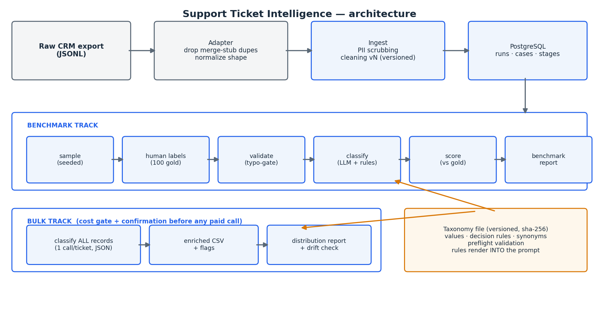

# Support Ticket Intelligence — measured LLM classification case study

Built an AI-assisted pipeline that enriched **701 CRM support cases** across three
dimensions: **product area, feature workflow, and issue type**.

Against a **100-ticket human benchmark**, the validated configuration achieved
**64.2% agreement across individual field decisions**, including **75.3%** on product
area, plus **81% distribution overlap** with the expert-labeled category mix. A
one-call-per-ticket JSON format reduced model calls by **67%** while remaining within
**0.4 percentage points** of the three-call benchmark. The full-population run cost
approximately **$2** and completed with zero API failures.

The analysis surfaced a transfer-related workload representing roughly **one in six
analyzable tickets**—a category not visible in the CRM’s existing reason structure—and
the resulting taxonomy informed a proposal to improve the CRM’s native reason codes.

> **Documentation-only portfolio repository.** The private application ran against
> confidential support data. Production code, customer messages, internal identifiers,
> and the proprietary taxonomy are not published. This repository contains a sanitized
> architecture, methodology, synthetic examples, and a runnable implementation of the
> core evaluation formulas.

## What I personally built

- The **three-dimensional taxonomy and labeling rules**, developed through clustering-assisted
  discovery and expert review
- The staged **ingest, cleaning, sampling, human-review, classification, scoring, and reporting**
  workflow
- A separate full-population classification path with a **server-side cost gate**
- The **100-ticket gold benchmark**, manually labeled against written decision rules
- A versioned taxonomy system with **values, decision rules, synonyms, and preflight validation**
- The evaluation and provenance layer recording model, prompt version, call mode, taxonomy hash,
  seed, input mode, cleaning version, and row counts
- Failure-mode analysis and an executive report translating technical results into operational
  recommendations

## Results

| Question | Verified result |
|---|---:|
| Product-area agreement | **75.3%** |
| Feature-workflow agreement | **64.5%** |
| Issue-type agreement | **52.7%** |
| Agreement across all individual field decisions | **64.2%** |
| Strict all-three-fields match | **33.3%** |
| Aggregate distribution overlap | **81.0%** |
| Selected high-volume category recall | **83–96%**, with small reported sample sizes |
| Full-population model cost | **~$2** |
| Total measured pilot cost | **$5.19** |
| Model-call reduction | **67%** |
| Full-run API failures | **0** |

These metrics answer different questions. Field agreement checks whether the same label was
assigned to the same field on the same ticket. Strict exact match requires all three labels on
one ticket to match. Distribution overlap checks whether the overall category mix was similar;
it is **not** ticket-level accuracy.

## Architecture



**Private implementation stack:** Python · FastAPI · HTMX · PostgreSQL · GPT-4o JSON mode ·
sentence-transformers · HDBSCAN · Microsoft Presidio · openpyxl

The system used two separate paths:

```text
Benchmark: ingest → sample → human labels → validate → classify → score → report
Bulk:      ingest → cost confirmation → classify all → enriched CSV → distribution report
```

The benchmark path measured model output against human labels. The bulk path classified the full
population but did not claim human-verified accuracy for all 701 records.

## Three-field contract

| Human benchmark field | Model prediction field |
|---|---|
| `human_product_area_l1` | `llm_product_area` |
| `human_feature_workflow_l1` | `llm_feature_workflow` |
| `issue_type` | `llm_issue_type` |

The public synthetic files preserve this same three-field structure.

## The measurement story

- **v1 — 67.7%:** the model never selected `Other`. Root cause: one instruction required the
  closest named category.
- **v2 — 66.3%:** an incorrectly scoped prompt note generated illegal values; counted exclusions
  made the regression visible.
- **v3 — 64.6%:** after the fixes, the measured iterations remained statistically
  indistinguishable at the available sample size.
- **Combined format — 64.2%:** one JSON response per ticket reduced calls by two-thirds while
  preserving measured performance.
- **Decision:** stop prompt-wording iteration. Further improvement requires more gold labels,
  different input context, a model change, or a hybrid approach.

Full details: [docs/methodology.md](docs/methodology.md)

## Run the synthetic evaluator

No third-party packages are required.

```bash
python3 scripts/score_example.py
```

The script evaluates all three fields and reports:

- Per-field exact-match accuracy
- Aggregate field accuracy
- Strict all-three-fields exact match
- Distribution overlap

The synthetic examples are intentionally illustrative. The verified private-project metrics are
recorded separately in `examples/example_benchmark_report.txt`.

## Repository contents

```text
README.md
LICENSE
docs/
  architecture.png
  methodology.md
  technical-overview.md
examples/
  sample_taxonomy.xlsx
  sample_taxonomy.csv
  synthetic_tickets.jsonl
  synthetic_gold.csv
  synthetic_predictions.csv
  example_benchmark_report.txt
scripts/
  score_example.py
```

## Key findings

- One broad CRM reason contained multiple distinct workflows, including transfers, password
  resets, activations, and permission grants
- Staff and login/access work accounted for **337 of 701 predicted labels (48%)**
- The model assigned **10.7%** of the full population to insufficient-information categories,
  consistent with the 10–12% rate observed in the expert sample
- `Other` remained a meaningful long-tail category rather than a modeling defect
- The system was useful for aggregate support-volume intelligence before it was reliable enough
  for unattended per-ticket automation
- The most durable operational output may be the improved native CRM reason structure rather than
  an always-on LLM service

## Limitations and decisions

- The benchmark used the **first customer email only**, so later diagnostic and resolution context
  was intentionally excluded
- The 701-record population was model-classified, not manually verified
- PII scrubbing was applied at ingest, but no claim of perfect removal is made
- One documented confusion involved access requests being read as unexpected behavior
- The private system was a production-style prototype, not an organization-wide deployed service
- Public examples are synthetic and do not reproduce the private taxonomy or ticket corpus

## Disclaimer

This repository is a public portfolio case study created from a private internal project. It
contains synthetic data, simplified examples, and genericized documentation only. No customer
data, employee data, credentials, internal case identifiers, proprietary source code, or
confidential company information is included.

AI tools supported drafting, structuring, and polishing this public case study. The analysis,
metric interpretation, sanitation choices, and final review remained human-directed.
